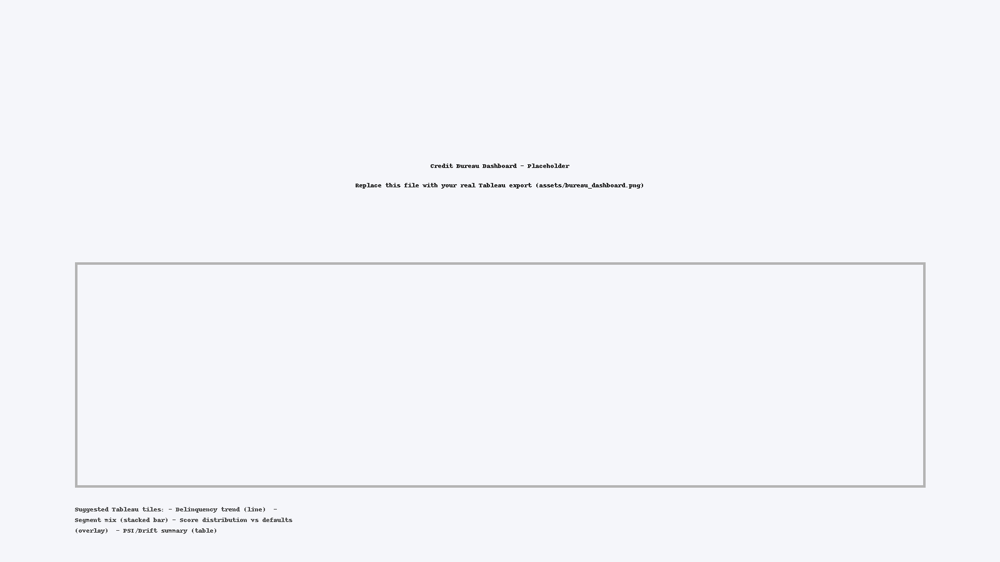

### Governance Gate (SageMaker)
- Thresholds: AUC >= 0.65, KS >= 0.20, PSI < 0.10
- Metrics source: `s3://aws-flagship-project/outputs/metrics/evaluation.json`
- Execution ARN: `arn:aws:sagemaker:us-east-1:678804053923:pipeline/cbsandbox-metrics-gate/execution/4e5ath56iwkq`
- Latest status: **Succeeded** (see screenshot in `/evidence/`)

### Dashboard (Tableau)

