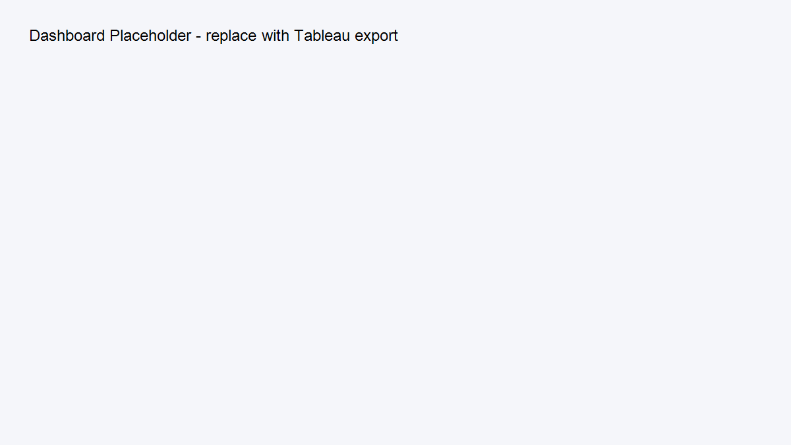

### Governance Gate (SageMaker)
- Thresholds: AUC >= 0.65, KS >= 0.20, PSI < 0.10
- Metrics source: `s3://aws-flagship-project/outputs/metrics/evaluation.json`
- Execution ARN: `arn:aws:sagemaker:us-east-1:678804053923:pipeline/cbsandbox-metrics-gate/execution/4e5ath56iwkq`
- Latest status: **Succeeded** (see screenshot in `/evidence/`)

### Dashboard (Tableau)


### Dashboard (Tableau)


---
(Contents formerly in CB_Sandbox/README.md)

# Credit Bureau Sandbox + AWS SageMaker (Reusable)

**Goal:** Build a modular, repeatable credit risk segmentation and reporting pipeline on AWS that can be promoted into **Regulatory-Grade AI for Credit Decisioning** with minimal refactor.

## Why this repo exists
- Establish **clear data contracts** and **config-driven** processing so new data sources or policy changes are 1-line config updates.
- Enforce **governance hooks** (model card, audit logs, reason codes) required for the next project.
- Provide **SageMaker-compatible pipeline** and **local parity** for fast iteration.

## Architecture (high level)
```
ingestion -> validation -> feature engineering -> training -> evaluation -> packaging -> (local|SageMaker) deploy
                                  |                                         |
                            data contracts                           governance outputs
```

### Reusable Interfaces
- **Data Contracts:** `data_contracts/bureau_schema.yaml`
- **Decision API Schemas:** `src/decision_api/schema.py`
- **Config:** `config/base.yaml` (override per env: dev/stg/prd)
- **Governance Artifacts:** `docs/model_card_template.md`, `docs/audit_log_schema.json`, `governance/policy_map.yaml`
- **SageMaker Pipeline Stub:** `pipelines/sagemaker/pipeline.py`

## Quickstart
```bash
# 1) Setup
python -m venv .venv && . .venv/bin/activate  # Windows: .venv\Scripts\activate
pip install -r requirements.txt

# 2) Run local training (uses config/base.yaml)
make train-local

# 3) Generate evaluation report + SHAP + KS/PSI
make evaluate

# 4) (Optional) Register & deploy to SageMaker
make sagemaker-pipeline
```

## Outputs (fed into next project)
- `outputs/models/` packaged model + feature manifest
- `outputs/metrics/` AUC, KS, PSI, drift
- `outputs/reports/` model card draft, explainability artifacts (SHAP), **adverse action reason candidates**
- `docs/audit_log_schema.json` + **inference-time audit logs**

## Next: Regulatory-Grade AI for Credit Decisioning
This repo emits standardized artifacts the next project will consume:
- Model package (+ version), feature manifest, and policy map
- Reason codes mapping for adverse action notices
- Audit logs aligned to `docs/audit_log_schema.json`

